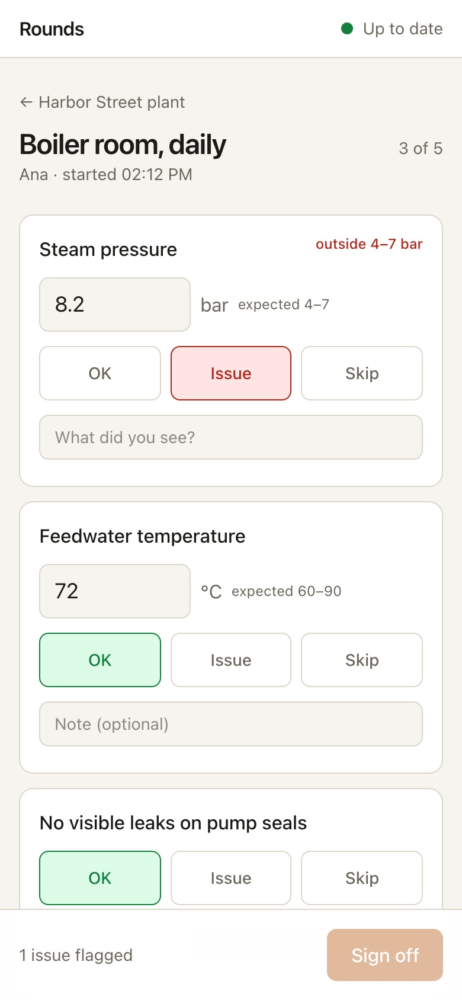
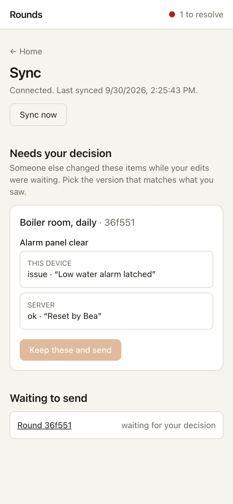

<p align="center">
  
</p>

<h1 align="center">Rounds</h1>

<p align="center">
  Maintenance rounds that work with no signal.<br>
  <sub>React 19 · TypeScript · IndexedDB · service worker · Node 24 · SQLite</sub>
</p>

<br>

A technician walks a plant with a checklist: read the pressure gauge, check
the pump seals for leaks, photograph the panel, sign off. Boiler rooms and
basements do not have Wi-Fi, so the app has to work as if the network were
optional, and then not lose anything when two people edit the same round
from two phones.

That last part is the project. The interesting code is a sync engine with an
outbox, a three-way merge, and a conflict screen that asks the person
instead of picking a winner by timestamp.

<p align="center">
  
  
</p>

## Running it

```bash
nvm use            # Node 24, for node:sqlite
npm install
npm run dev        # API on :8788, Vite on :5174
```

Open http://localhost:5174, give a name, pick a site, start a round. Then
turn the network off in devtools (or the Wi-Fi), keep working, reload the
page, turn it back on. To see a conflict, edit the same item from a second
browser profile while the first is offline.

| Command                                                                      |                                                                         |
| ---------------------------------------------------------------------------- | ----------------------------------------------------------------------- |
| `npm test`                                                                   | shared, server and client tests                                         |
| `npm run typecheck`                                                          | `tsc` per workspace                                                     |
| `npm run build`                                                              | client (with the service worker) to `web/dist`, server to `server/dist` |
| `npm start`                                                                  | one process serves the API and the built client                         |
| `docker build -t rounds . && docker run -p 8788:8788 -v rounds:/data rounds` | the same, in a container                                                |

## How offline works

Three layers, each with one job.

**The service worker** precaches the app shell, so the page opens with no
network at all. It never caches `/api`: the data lives in IndexedDB, and a
worker that cached API responses would be a second, dumber source of truth.
A new version is offered in a banner, never applied by reloading under
someone's fingers.

**IndexedDB, through a small `Repo`**, holds sites, checklists, and two
copies of every round: the one this device edits and the last one the server
confirmed. Every edit also puts the round in an outbox. The in-memory copy is
updated before the disk write starts, so two taps within one write's latency
build on each other instead of racing.

**The sync engine** drains the outbox when online and pulls what changed
since the last sync. It is the part worth reading, in
`web/src/sync/engine.ts`, and it is about 150 lines.

## How conflicts work

The server keeps a version counter per round. A write names the version it
was made from; the check and the write are one SQL statement, so two devices
racing cannot both win. The loser gets a 409 with the current record.

The client then merges three ways: the last confirmed copy (base), its own
copy (mine), and the server's (theirs).

- An item only one side changed is taken from that side.
- An item both sides changed the same way is not a conflict.
- An item both sides changed differently is a conflict. The merge does not
  choose. The round is parked, the rest of the queue keeps going, and the
  sync page shows both versions per item for the person to pick. Their
  choice is pushed as a new edit from the server's version.

A pull never touches a round with edits waiting, not even its server copy,
because that copy is the base the next merge needs. The push will hit the
409 and merge against the real current record.

Whole-field last-writer-wins would have been thirty lines shorter. On a
maintenance round, silently replacing "issue: seal weeping" with "ok" is
the wrong thirty lines to save.

## Things worth opening

**`shared/src/merge.ts`.** The three-way merge, pure, with the cases
spelled out in its tests: one side, both sides same, both sides different,
sign-off on one side.

**`web/src/sync/engine.ts`.** Push, merge on 409, retry, park, pull. Going
offline is not an error, just a reason to wait. Tests drive it against a
fake server with the same version rule, including the tab closing with the
queue on disk.

**`server/src/store.ts`.** `putRound` is one `UPDATE ... WHERE version = ?`.
No transaction dance, no locks.

**`web/src/components/ItemRow.tsx`.** Sized for a thumb in a glove. A
reading outside the checklist's range becomes an issue on its own; someone
has to say otherwise.

## Tests

```bash
npm test
```

35 tests. The merge and the validators as pure functions; the server over
real HTTP on a random port, including the losing write; the client's repo
and engine against `fake-indexeddb` and a fake API with an offline switch:
queue while offline, survive a reload, auto-merge a clean 409, park a real
conflict and push the rest, resolve and push, pull without clobbering, keep
an edit made while a push is in flight, refuse to merge against a base of
the wrong version, carry on past a rejected round or photo, reopen a
sign-off that raced an edit. Component tests cover the item row (including
typing while a pull changes the item) and the conflict card.

## Layout

```
shared/src/
  types.ts       site, checklist, round, item
  merge.ts       three-way merge and conflict resolution
  validate.ts    untrusted JSON to a Round, or an error that says why
server/src/
  store.ts       SQLite, versioned writes, changed-since
  http.ts        sync pull, round put, photos, static files
  seed.ts        two sites and three checklists
web/src/
  data/db.ts     IndexedDB schema
  data/repo.ts   memory + write-through, outbox, conflicts
  sync/engine.ts push, merge, pull
  components/    Home, SitePage, RoundPage, ItemRow, SyncPage
```

## What's missing

- No accounts. The name typed on first launch is the technician.
- Photos are redrawn to jpeg at 1600px before storing, which handles HEIC
  and the 50 MP modes; there is no retry UI for a photo the server refused
  beyond showing the reason.
- No background sync when the app is closed. The Background Sync API is
  Chromium-only; the engine syncs whenever the app is open and online.
- Checklists are seeded, not editable. An admin screen would be a separate
  project.
